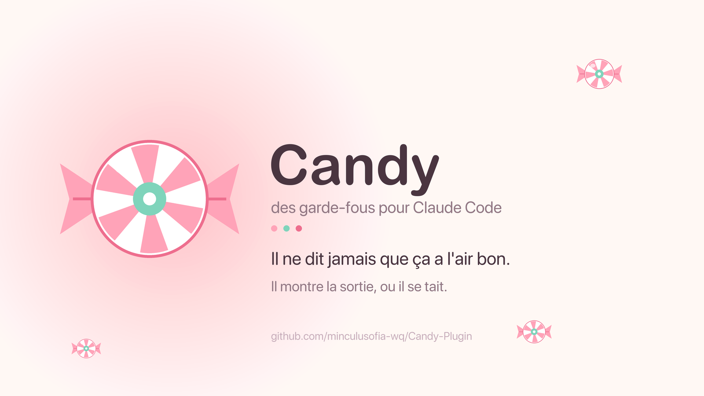
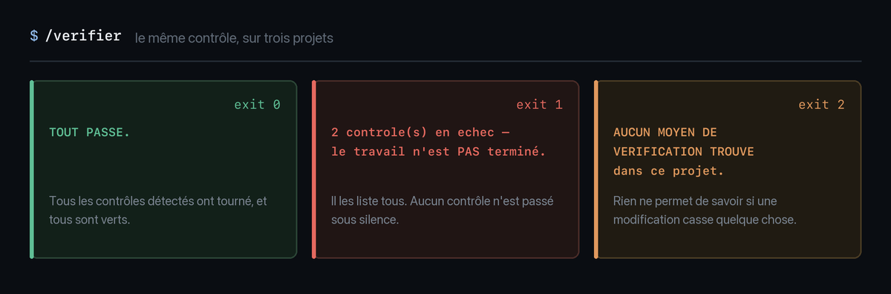

# Candy Plugin

*[English version](README.md) · Français*

<p align="center">
  
</p>

[](LICENSE)


<p align="center">
  
</p>

<p align="center"><i>Trois projets, trois verdicts. Il ne dit jamais « ça a l'air bon ».</i></p>

Un plugin Claude Code, en français, qui empêche trois choses :

1. **Que Claude affirme sans avoir lu.** Chaque chiffre, chaque nom de fichier,
   chaque contrainte technique doit porter sa source `fichier:ligne`.
2. **Que Claude vous flatte.** Verdict en première phrase, failles avant qualités,
   pas de « oui mais » déguisé.
3. **Que « c'est fait » soit dit sans preuve.** Un contrôle universel détecte tout
   seul comment vérifier le projet courant et rend un verdict.

Aucune de ces règles ne sort d'un article de blog. Chacune a été écrite après
coup, le jour où un « c'est fait » s'est révélé faux — sur des bots en production
comme sur une app mobile.

## Installation

```
/plugin marketplace add minculusofia-wq/Candy-Plugin
/plugin install candy-plugin
```

Les règles (`rules/`) ne sont pas chargées par le plugin : Claude Code les lit
depuis votre dossier personnel. Copiez celles qui vous intéressent :

```
cp -R rules/*.md ~/.claude/rules/
```

Elles fonctionnent séparément — prenez-en une, pas les huit.

## Ce que ça contient

| | |
|---|---|
| **8 règles** | vérifier avant d'affirmer · honnêteté brutale · discipline de code · porte de phase · choix du modèle · réflexes de travail · style de communication · routage des commandes |
| **5 commandes** | `/verifier` `/debug` `/fin-phase` `/fin-session` `/maj-docs` |
| **2 agents** | `relecteur-securite` · `relecteur-de-phase` (contexte neuf, ne consomment pas la conversation) |
| **11 hooks + 2 scripts** | rappel d'ouverture de phase, garde avant écriture, protection des secrets, contrôle avant push, relecture de la réponse en fin de tour |

### La pièce la plus utile : `hooks/verifier-projet.sh`

Un script sans configuration qui, sur n'importe quel projet, cherche de quoi le
vérifier (tests, lint, types, build) et rend trois verdicts possibles :

- `0` tout passe
- `1` au moins un contrôle échoue
- `2` **aucun moyen de vérification n'existe dans ce projet** — le cas le plus
  utile, celui que personne ne signale d'habitude

## Pour quels projets ? Bots, apps, et tout le reste

Ces règles sont nées sur deux terrains : des **bots de trading** qui tournent en
continu sur un serveur, et une **app iOS** construite phase par phase. La plus
grande partie ne dépend ni de l'un ni de l'autre.

| Ce qui marche partout | Spécifique aux bots et services qui tournent | Spécifique aux apps découpées en phases |
|---|---|---|
| **Règles** : vérifier avant d'affirmer · honnêteté brutale · discipline de code · réflexes de travail · choix du modèle · routage des commandes | La section « stratégies de bots » de `brutal-honesty.md` | `porte-de-phase.md` |
| **Commandes** : `/verifier` · `/maj-docs` | `/debug` (mode simulation, jamais sur le serveur) · `/fin-session` | `/fin-phase` |
| **Agents** : `relecteur-securite` | Sa section « fonds et transactions » | `relecteur-de-phase` |
| **Hooks** : contrôle du projet, protection des secrets, garde avant écriture, README avant push, relecture de la réponse, audit des `.md` | `rule13-source-or-silence.sh` | `ouverture-de-phase.sh` · `rule12-phase-debug-required.sh` |

**En clair :** si vous ne faites ni bot ni app à phases, prenez la première
colonne — c'est déjà l'essentiel. Rien n'oblige à tout installer : les règles se
copient une par une, et un hook se retire en supprimant sa ligne dans
`hooks/hooks.json`.

`/fin-phase` mérite un avertissement à part : ses 300 lignes sont le rituel réel
de l'auteur sur une app iOS, gardé entier plutôt que vidé en modèle creux. Il
cite ses propres documents, ses pièges numérotés, ses arbitrages datés. À lire
comme un exemple à adapter — la forme se réutilise, le contenu non.

Les exemples parlent de trading et d'iPhone parce que c'est là que ces règles ont
été payées cher. Le principe, lui, ne change pas : **rien n'est vrai parce que
Claude l'a écrit** — ni sur un bot, ni sur une app, ni sur un script de trois
lignes.

## `/fin-session` ou `/fin-phase` ? La question qu'on se pose le plus

Les deux ferment un travail. Elles ne ferment pas la même chose.

**`/fin-session` ferme une séance.** Le projet, lui, continue de tourner — un bot
en production n'est jamais « fini ». La commande laisse le dépôt propre : debug
optionnel, audit des `.md`, mise à jour de la doc, **un seul** commit, push, résumé.
Elle ne juge pas le travail, elle le range.

**`/fin-phase` ferme une livraison.** Une app découpée en phases atteint des états
qu'on déclare atteints — et cette déclaration peut être fausse. La commande relit
la porte de sortie de la phase **point par point**, liste ce que seul l'appareil
réel peut trancher, et rend un verdict à **trois** états :

| Verdict | Ce qu'il veut dire |
|---|---|
| `ROUGE` | Un contrôle machine échoue. On s'arrête, on corrige. |
| `EN ATTENTE DE TON APPAREIL` | Tout est vert côté machine, il reste des points que vous seul tranchez. |
| `VERT` | Vous avez répondu à tout. |

Le 🟢 dans la roadmap et l'étiquette git ne se posent **qu'en `VERT`**.

### Comment choisir en trois secondes

> **Votre projet a-t-il une roadmap avec des phases numérotées, dont certaines
> ne se vérifient qu'à la main — sur un téléphone, un écran, un appareil réel ?**
>
> Oui → `/fin-phase`. Non → `/fin-session`.

En pratique : un bot, un script, un service qui tourne → `/fin-session`. Une app
construite phase par phase → `/fin-phase`.

### Ce qui se passe si vous vous trompez

| | |
|---|---|
| `/fin-session` sur une app à phases | Le dépôt est propre et la doc à jour, mais **rien n'a vérifié que la phase est réellement livrée**. Une phase passe en 🟢 sur la foi de tests qui ne voient pas un bouton mort. |
| `/fin-phase` sur un bot | La commande cherche une roadmap et une porte de sortie qui n'existent pas. Elle s'arrête sans rien casser — mais elle ne fait rien d'utile. |

Un garde-fou pris pour une validation est pire que pas de garde-fou : c'est
exactement ce que `/fin-phase` existe pour empêcher, et c'est pourquoi elle refuse
de conclure seule.

### Les deux se répondent

`/fin-phase` tient la **porte de sortie** d'une phase. La règle
[porte-de-phase.md](rules/porte-de-phase.md) tient la **porte d'entrée** de la
suivante, et le hook `ouverture-de-phase.sh` la rappelle au démarrage de la
conversation d'après. Une phase ne se ferme pas sans vous, et la suivante ne
s'ouvre pas sur un état faux.

## Tests

```
make test          # tout : six groupes, 89 cas, environ 18 secondes
make test-rapide   # le sous-ensemble de fin de tour, environ 8 secondes
```

Six groupes, 89 cas : *j'envoie ceci à ce hook, j'attends ce verdict*. Chacun a
été vérifié en remettant le défaut d'origine — un test qui passe toujours ne
vaut rien. Voir [tests/README.md](tests/README.md).

### Votre projet, en fin de tour

Par défaut, rien à faire : le contrôle lance la suite complète de votre projet,
comme avant. Si elle est trop longue pour tourner à chaque fin de tour, déclarez
une cible `test-rapide` dans votre `Makefile` — c'est elle qui tournera alors,
et le verdict dira explicitement que la suite complète n'a pas tourné :

```
SOUS-ENSEMBLE PASSE — la suite complete n'a PAS tourne.
Ne pas annoncer que le travail est fini sans avoir lance /verifier.
```

Jamais « tout passe » sur une couverture partielle : c'est le mensonge que ce
plugin existe pour empêcher.

## Prérequis

- `python3` (utilisé par les hooks). **Pas de `jq`** — il n'est pas installé
  par défaut sur macOS, et un hook qui dépend d'un binaire absent échoue en
  silence : le contrôle avant push ne se déclenchait tout simplement jamais.
  Cette dépendance a été supprimée.
- **Claude Code 2.1.196 ou plus récent** pour la relecture de la réponse : elle
  lit le champ `last_assistant_message`, que les versions antérieures n'envoient
  pas toujours. En dessous, elle ne signale qu'une faute sur deux.
- `pytest` et `npm` sont **facultatifs**, et seulement pour les tests du paquet :
  treize cas vérifient que le contrôle universel lance bien ces familles. Sans
  eux, ces cas sont sautés en le disant, et la suite reste verte.
- Testé sur macOS. Les hooks sont du bash POSIX-ish ; Linux devrait passer, non testé.
- Le hook `skills-reminder.sh` propose `/grill-with-docs` et `/tdd`, qui sont des
  skills tierces non fournies ici. Sans elles, il ne fait que suggérer.

## Ce qui n'est pas là, volontairement

Les règles de trading, les seuils de risque et les patterns de stratégie de
l'auteur. Ils ne servent qu'à ses bots.

Deux hooks ont été retirés avant publication plutôt que livrés cassés : l'un
bloquait toute commande `ssh` (contrainte très personnelle, et sa liste
d'exceptions se désarmait avec n'importe quelle commande contenant le mot
magique), l'autre réclamait un commit à la fin de *chaque tour* au lieu de
chaque session.

## Support

Partagé tel quel. Les issues sont lues, pas garanties.

## Licence

MIT.
