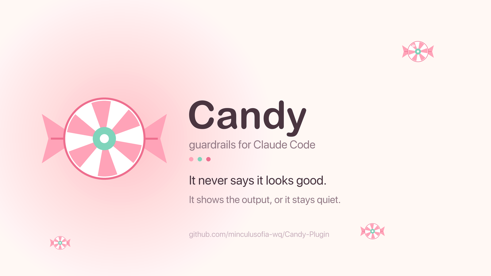
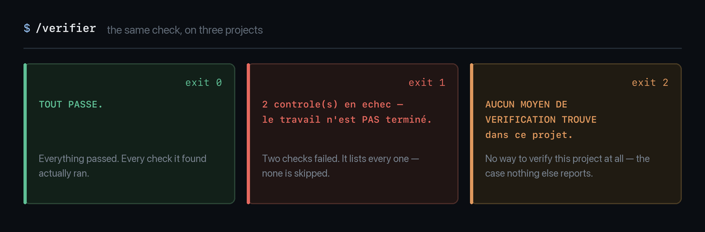

# Candy Plugin

*English · [Version française](README.fr.md)*

<p align="center">
  
</p>

[](LICENSE)


<p align="center">
  
</p>

<p align="center"><i>Three projects, three verdicts. It never says "looks good".</i></p>

A Claude Code plugin that stops three things:

1. **Claude asserting things it hasn't read.** Every number, filename and technical
   constraint must carry its `file:line` source.
2. **Claude flattering you.** Verdict in the first sentence, flaws before merits,
   no "yes, but" in disguise.
3. **"It's done" without proof.** A universal check figures out on its own how to
   verify the current project and returns a verdict.

None of these rules came from a blog post. Each one was written after the fact,
the day a "done" turned out to be false — on production bots as much as on a
mobile app.

**The content is in French** — the rules, the commands and the hook messages all
speak French to Claude, which answers in French. This README is the English one;
the plugin itself is not translated. Translating it is issue #1 if anyone wants it.

## Install

```
/plugin marketplace add minculusofia-wq/Candy-Plugin
/plugin install candy-plugin
```

Rules are not loaded by the plugin — Claude Code reads them from your own folder:

```
cp -R rules/*.md ~/.claude/rules/
```

They work on their own. Take one, not all nine.

## What's inside

| | |
|---|---|
| **9 rules** | verify before asserting · brutal honesty · code discipline · phase gate · model choice · working reflexes · communication style · command routing · one piece of information, one file |
| **6 commands** | `/verifier` `/debug` `/fin-phase` `/fin-session` `/maj-docs` `/maintenance` |
| **2 agents** | `relecteur-securite` · `relecteur-de-phase` — security and phase reviewers running in a fresh context, so they don't eat your conversation |
| **11 hooks + 6 scripts** | phase-opening reminder, reminder of the task waiting on a project, setup maintenance reminder, document-set check at every session start (missing files, files outside the set, oversized CLAUDE.md), pre-write guard, secret protection, pre-push check, answer review at the end of each turn, a check on the setup itself |

### The most useful piece: `hooks/verifier-projet.sh`

A zero-config script that, on any project, looks for a way to verify it (tests,
lint, types, build) and returns one of three verdicts:

- `0` everything passes
- `1` at least one check fails
- `2` **there is no way to verify this project** — the most useful case, and the
  one nothing else tells you about

### Per-project reminders

When a task has to wait until you next open a project, write it once in
`~/.claude/rappels-projets.txt`:

```
~/Desktop/mon-app | ranger la documentation | ~/notes/consigne.md |
~/Desktop/mon-app | ouvrir la phase 4 | - | ROADMAP.md::^### Phase 3.*🟢
```

One line per task: the project folder, the task, where to read the details, and
an optional condition. `file::pattern` only shows the line if that file in the
project contains the pattern — here, not before phase 3 is marked 🟢.

When you open the project, or one of its subfolders, the task shows up and
Claude gets it along with its details. Just answer "go". Once the task is done,
its line gets removed. Without that file, the hook stays silent.

### The maintenance reminder

You don't have to remember `/maintenance`. When a session opens in `~` or
`~/.claude` — never in a project, where it would pull you away from the work —
the `rappel-entretien.sh` hook offers it in two cases:

- the last maintenance is more than 30 days old, or never happened;
- the session runs on an Opus or Fable model that has never been used to
  review the instructions. Instructions written for an older model can get in
  the way of the next one, which follows them more literally: step 3 of
  `/maintenance` has them audited by the `prompt-audit` subcommand of the
  `claude-api` skill, drops anything that would remove a rule born from an
  incident, and shows you the rest as a single list to approve.

Just answer "go". The rest of the time, the hook stays silent.

## Which projects is this for? Bots, apps, and everything else

These rules were forged on two fronts: **trading bots** running non-stop on a
server, and an **iOS app** built phase by phase. Most of it depends on neither.

| Works anywhere | Specific to bots and long-running services | Specific to apps built in phases |
|---|---|---|
| **Rules**: verify before asserting · brutal honesty · code discipline · working reflexes · model choice · command routing · one piece of information, one file | The "bot strategies" section of `brutal-honesty.md` | `porte-de-phase.md` |
| **Commands**: `/verifier` · `/maj-docs` · `/maintenance` | `/debug` (dry-run mode, never on the server) · `/fin-session` | `/fin-phase` |
| **Agents**: `relecteur-securite` | Its "funds and transactions" section | `relecteur-de-phase` |
| **Hooks**: project check, secret protection, pre-write guard, answer review, `.md` audit, document-set check, waiting-task reminder, maintenance reminder | `rule13-source-or-silence.sh` | `ouverture-de-phase.sh` · `rule12-phase-debug-required.sh` |

**In short:** if you build neither bots nor phased apps, take the first column —
that's already the heart of it. Nothing forces you to install everything: rules
are copied one at a time, and a hook is removed by deleting its line in
`hooks/hooks.json`.

`/fin-phase` deserves a warning of its own: its 300 lines are the author's real
iOS ritual, kept whole rather than hollowed out into an empty template. It names
its own documents, its own numbered pitfalls, its own dated trade-offs. Read it
as an example to adapt — the shape is reusable, the content is not.

The examples talk about trading and iPhones because that's where these rules were
paid for. The principle doesn't change: **nothing is true because Claude wrote
it** — not on a bot, not on an app, not on a three-line script.

## `/fin-session` or `/fin-phase`? The question that comes up most

Both close a piece of work. They don't close the same thing.

**`/fin-session` closes a working session.** The project itself keeps running — a
bot in production is never "done". The command leaves the repo clean: optional
debug, `.md` audit, docs updated, **one** commit, push, summary. It doesn't judge
the work, it tidies it.

**`/fin-phase` closes a delivery.** An app built in phases reaches states you
declare reached — and that declaration can be false. The command re-reads the
phase's exit gate **point by point**, lists what only a real device can settle,
and returns one of **three** verdicts:

| Verdict | Meaning |
|---|---|
| `ROUGE` (red) | A machine check fails. Stop, fix it. |
| `EN ATTENTE DE TON APPAREIL` (waiting on your device) | Green on the machine side; some points only you can settle. |
| `VERT` (green) | You answered everything. |

The 🟢 in the roadmap and the git tag are only set on `VERT`.

### How to choose in three seconds

> **Does your project have a roadmap with numbered phases, some of which can only
> be checked by hand — on a phone, a screen, a real device?**
>
> Yes → `/fin-phase`. No → `/fin-session`.

In practice: a bot, a script, a running service → `/fin-session`. An app built
phase by phase → `/fin-phase`.

### What happens if you pick the wrong one

| | |
|---|---|
| `/fin-session` on a phased app | The repo is clean and the docs current, but **nothing checked that the phase was actually delivered**. A phase turns green on the strength of tests that can't see a dead button. |
| `/fin-phase` on a bot | It looks for a roadmap and an exit gate that don't exist. It stops without breaking anything — it just does nothing useful. |

A guardrail mistaken for a validation is worse than no guardrail: that is exactly
what `/fin-phase` exists to prevent, and why it refuses to conclude on its own.

### The two answer each other

`/fin-phase` holds the **exit gate** of a phase. The rule
[porte-de-phase.md](rules/porte-de-phase.md) holds the **entry gate** of the next
one, and the `ouverture-de-phase.sh` hook repeats it when the next conversation
starts. A phase never closes without you, and the next never opens on a false state.

The `jeu-de-documents.sh` hook checks at every session start, in every project,
that the documents expected by [une-info-un-fichier.md](rules/une-info-un-fichier.md)
are there — it reads the rule's table, it keeps no copy of it. A missing file
becomes a red point of the entry gate, and the gate applies as soon as a phase
plan is written: a plan whose first phase cannot open is a wrong plan.

## Tests

```
make test
```

Nine groups (`make test` prints how many cases each one plays): *send this to that hook, expect that verdict*. Those in
the first eight groups were checked by putting the original defect back; the
ninth replays the incident that gave birth to the document-set check, and the
failures it must report instead of staying silent. A test that always passes is
worth nothing. See [tests/README.md](tests/README.md).

## Requirements

- `python3` (used by the hooks). **Required**: without it, the guards refuse
  instead of letting things through — Claude can no longer run a command or write
  a file until `python3` is fixed, and the refusal message says so. A blind guard
  that lets everything through is worse than one that blocks. **No `jq`** — it
  isn't guaranteed to be on
  every machine, and a hook that depends on a missing binary fails in silence:
  on a machine without it, the pre-push check simply never ran. That dependency
  was removed.
- **Claude Code 2.1.196 or later** for the answer review: it reads the
  `last_assistant_message` field, which earlier versions don't always send.
  Below that version it catches about one slip in two.
- `pytest` and `npm` are **optional**, and only for the package's own tests:
  fourteen cases check that the universal control does run those families.
  Without them those cases are skipped out loud, and the suite stays green.
- Tested on macOS. The hooks are plain bash; Linux should work, untested.
- **Worth knowing**: at the end of a turn, if a code file changed in a git
  repo, the universal check runs the project's test suite — that's its job. In
  a repo whose code you don't know, that code is what runs. The hooks
  themselves never execute a Python module dropped in the project
  (`python3 -I`, checked by `tests/06-paquet.sh`).

## Deliberately not included

The author's trading rules, risk thresholds and strategy patterns. They only serve
their own bots.

Two hooks were removed before publishing rather than shipped broken: one blocked
every `ssh` command (a personal constraint, and its exception list could be
disarmed by any command merely containing the magic word), the other nagged for a
commit at the end of *every* turn instead of every session.

Three more were removed later, after measuring a month of the author's
conversations. `rule7-readme-before-push.sh` and `rule9-code-discipline.sh`
printed their warnings and exited with code 0: Claude Code then sends those
messages to the debug log only, and nobody ever saw them. `skills-reminder.sh`
reacted to words, not meaning: nearly three triggers out of four came from
automatic messages (task notifications, subagent reports, expanded commands), and on a sample of real
messages it was right only one time in five. The setup check now spots this
kind of silent hook.

## Support

Shared as is. Issues are read, not guaranteed.

## License

MIT.
