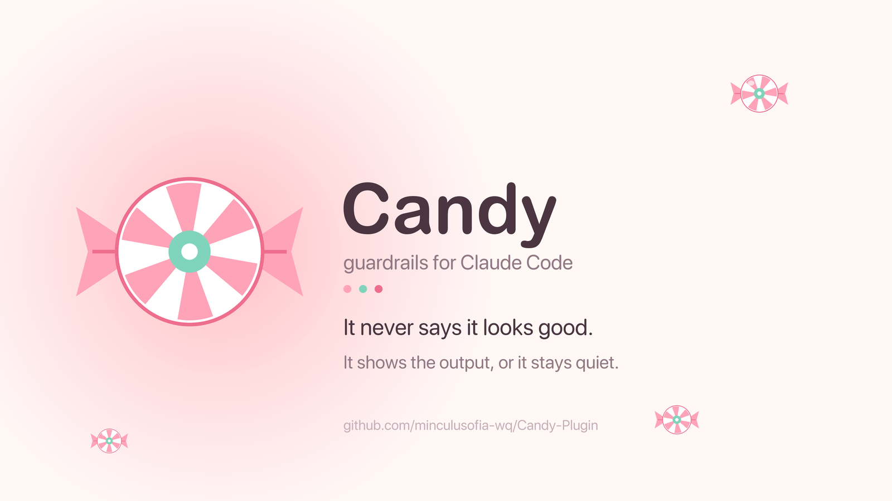
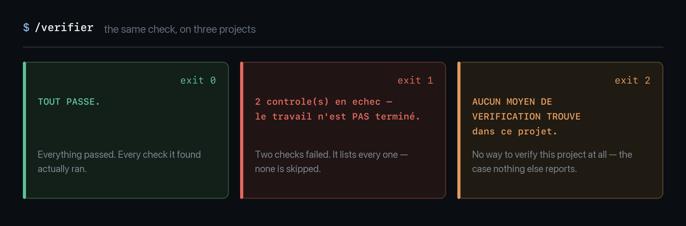

# Candy Plugin

*English · [Version française](README.fr.md)*

<p align="center">
  
</p>

[](LICENSE)


<p align="center">
  
</p>

<p align="center"><i>Three projects, three verdicts. It never says "looks good".</i></p>

A Claude Code plugin that stops three things:

1. **Claude asserting things it hasn't read.** Every number, filename and technical
   constraint must carry its `file:line` source.
2. **Claude flattering you.** Verdict in the first sentence, flaws before merits,
   no "yes, but" in disguise.
3. **"It's done" without proof.** A universal check figures out on its own how to
   verify the current project and returns a verdict.

None of these rules came from a blog post. Each one was written after the fact,
the day a "done" turned out to be false — on production bots as much as on a
mobile app.

**The content is in French** — the rules, the commands and the hook messages all
speak French to Claude, which answers in French. This README is the English one;
the plugin itself is not translated. Translating it is issue #1 if anyone wants it.

## Install

```
/plugin marketplace add minculusofia-wq/Candy-Plugin
/plugin install candy-plugin
```

Rules are not loaded by the plugin — Claude Code reads them from your own folder:

```
cp -R rules/*.md ~/.claude/rules/
```

They work on their own. Take one, not all of them.

## What's inside

| | |
|---|---|
| **Rules** | verify before asserting · brutal honesty · code discipline · phase gate · model choice · working reflexes · communication style · command routing · one piece of information, one file |
| **Commands** | `/verifier` `/debug` `/fin-phase` `/fin-session` `/maj-docs` `/maintenance` |
| **Agents** | `relecteur-securite` · `relecteur-de-phase` — security and phase reviewers running in a fresh context, so they don't eat your conversation |
| **Hooks and scripts** | phase-opening reminder, reminder of the model and the four settings to recommend at the start of a task (mode, effort, ultracode, advisor), reminder of the task waiting on a project, setup maintenance reminder, document-set check at every session start (missing files, files outside the set, oversized CLAUDE.md), secret files guarded against both writing and reading, secret protection (a value written out, a `.env` printed, a `git add` that would take it along), pre-push check (the repo and the commits actually pushed), a git that would skip the repo's own hooks (`--no-verify`, `core.hooksPath`, `HUSKY=0`…) refused, end-of-turn project check (time-boxed, only on what changed during the turn), answer review at the end of each turn, a check on the setup itself |

### The most useful piece: `hooks/verifier-projet.sh`

A zero-config script that, on any project, looks for a way to verify it (tests,
lint, types, build) and returns one of three verdicts:

- `0` everything passes
- `1` at least one check fails
- `2` **there is no way to verify this project** — the most useful case, and the
  one nothing else tells you about

A `make test` target is followed through its prerequisites and sub-makes
(`test: test-back`, `$(MAKE) -C backend test`), so the same tests never run
twice. `VERIFIER_A_BLANC=1` lists the checks it would run without running any.

### Per-project reminders

When a task has to wait until you next open a project, write it once in
`~/.claude/rappels-projets.txt`:

```
~/Desktop/mon-app | ranger la documentation | ~/notes/consigne.md |
~/Desktop/mon-app | ouvrir la phase 4 | - | ROADMAP.md::^### Phase 3.*🟢
```

One line per task: the project folder, the task, where to read the details, and
an optional condition. `file::pattern` only shows the line if that file in the
project contains the pattern — here, not before phase 3 is marked 🟢.

When you open the project, or one of its subfolders, the task shows up and
Claude gets it along with its details. Just answer "go". Once the task is done,
its line gets removed. Without that file, the hook stays silent.

### The maintenance reminder

You don't have to remember `/maintenance`. When a session opens in `~` or
`~/.claude` — never in a project, where it would pull you away from the work —
the `rappel-entretien.sh` hook offers it in two cases:

- the last maintenance is more than 30 days old, or never happened;
- the session runs on an Opus or Fable model that has never been used to
  review the instructions. Instructions written for an older model can get in
  the way of the next one, which follows them more literally: step 3 of
  `/maintenance` has them audited by the `prompt-audit` subcommand of the
  `claude-api` skill, drops anything that would remove a rule born from an
  incident, and shows you the rest as a single list to approve.

Just answer "go". The rest of the time, the hook stays silent.

Checks that only make sense for your own setup go in
`~/.claude/hooks/verifier-setup-local.sh`: the setup check runs it at the end
and counts the points it reports. Phrases that mean "not done yet" in your
projects (beyond "to create", "to decide", "not started") go one per line in
`~/.claude/motifs-audit-md.txt`, read by the `.md` audit.

## The commands

| Command | What it does |
|---|---|
| `/verifier` | Runs the project check (tests, quality, types, security, document set) and gives the verdict |
| `/debug` | Full project debug, always local: backend, frontend, endpoints, tests, one bug fixed at a time |
| `/fin-session` | Closes a session on a project without phases: debug if code changed, documents brought back in line, one commit, push |
| `/fin-phase` | Closes a phase: check, exit gate reviewed point by point, run on the real device, documents, commit |
| `/maj-docs` | Brings the project's `.md` files back in line with the code, each piece of information in one file, commit and push |
| `/maintenance` | Upkeep of `~/.claude`: mechanical check, transcript review, instruction audit, then `/doctor` and `/skill-doctor` for you to type |

No need to remember them: `rules/routage-commandes.md` makes Claude run the
right one when you write "debug", "fin de session", "fin de phase" or "mets à
jour la doc".

### Claude Code commands the rules make Claude suggest

Claude can't run these itself; it suggests them in one line, at the right
moment, with the command to type.

| Command | What it does | When it is suggested |
|---|---|---|
| `/effort` | Changes how much the model reasons, and turns ultracode on | At the start of every task (`choix-du-modele.md`) |
| `/advisor` | Has a second, stronger model consulted during the task | Hard design work, a defect that resists |
| `/code-review` | Reviews the code for bugs | Code touching money, secrets, anything irreversible |
| `/rewind` | Rolls the code and the conversation back to an earlier point | A wrong direction was taken |
| `/context` then `/clear` | Shows what fills the conversation, then starts fresh | Long conversation, second failure on the same defect |
| `/btw` | Asks a side question without adding it to the history | A question off the current topic |
| `/usage` | Session cost and plan limits | End of a long task, doubt about spending |
| `/doctor`, `/skill-doctor` | Installation checkup; context cost of each skill | During `/maintenance` |

## Which projects is this for? Bots, apps, and everything else

These rules were forged on two fronts: **trading bots** running non-stop on a
server, and an **iOS app** built phase by phase. Most of it depends on neither.

| Works anywhere | Specific to bots and long-running services | Specific to apps built in phases |
|---|---|---|
| **Rules**: verify before asserting · brutal honesty · code discipline · working reflexes · model choice · command routing · one piece of information, one file | The "bot strategies" section of `brutal-honesty.md` | `porte-de-phase.md` |
| **Commands**: `/verifier` · `/maj-docs` · `/maintenance` | `/debug` (dry-run mode, never on the server) · `/fin-session` | `/fin-phase` |
| **Agents**: `relecteur-securite` | Its "funds and transactions" section | `relecteur-de-phase` |
| **Hooks**: project check, secret protection, pre-write guard, answer review, `.md` audit, document-set check, waiting-task reminder, maintenance reminder | `rule13-source-or-silence.sh` | `ouverture-de-phase.sh` · `rule12-phase-debug-required.sh` |

**In short:** if you build neither bots nor phased apps, take the first column —
that's already the heart of it. Nothing forces you to install everything: rules
are copied one at a time, and a hook is removed by deleting its line in
`hooks/hooks.json`.

`/fin-phase` deserves a warning of its own: its 300 lines are the author's real
iOS ritual, kept whole rather than hollowed out into an empty template. It names
its own documents, its own numbered pitfalls, its own dated trade-offs. Read it
as an example to adapt — the shape is reusable, the content is not.

The examples talk about trading and iPhones because that's where these rules were
paid for. The principle doesn't change: **nothing is true because Claude wrote
it** — not on a bot, not on an app, not on a three-line script.

## `/fin-session` or `/fin-phase`? The question that comes up most

Both close a piece of work. They don't close the same thing.

**`/fin-session` closes a working session.** The project itself keeps running — a
bot in production is never "done". The command leaves the repo clean: optional
debug, `.md` audit, docs updated, **one** commit, push, summary. It doesn't judge
the work, it tidies it.

**`/fin-phase` closes a delivery.** An app built in phases reaches states you
declare reached — and that declaration can be false. The command re-reads the
phase's exit gate **point by point**, lists what only a real device can settle,
and returns one of **three** verdicts:

| Verdict | Meaning |
|---|---|
| `ROUGE` (red) | A machine check fails. Stop, fix it. |
| `EN ATTENTE DE TON APPAREIL` (waiting on your device) | Green on the machine side; some points only you can settle. |
| `VERT` (green) | You answered everything. |

The 🟢 in the roadmap and the git tag are only set on `VERT`.

### How to choose in three seconds

> **Does your project have a roadmap with numbered phases, some of which can only
> be checked by hand — on a phone, a screen, a real device?**
>
> Yes → `/fin-phase`. No → `/fin-session`.

In practice: a bot, a script, a running service → `/fin-session`. An app built
phase by phase → `/fin-phase`.

### What happens if you pick the wrong one

| | |
|---|---|
| `/fin-session` on a phased app | The repo is clean and the docs current, but **nothing checked that the phase was actually delivered**. A phase turns green on the strength of tests that can't see a dead button. |
| `/fin-phase` on a bot | It looks for a roadmap and an exit gate that don't exist. It stops without breaking anything — it just does nothing useful. |

A guardrail mistaken for a validation is worse than no guardrail: that is exactly
what `/fin-phase` exists to prevent, and why it refuses to conclude on its own.

### The two answer each other

`/fin-phase` holds the **exit gate** of a phase. The rule
[porte-de-phase.md](rules/porte-de-phase.md) holds the **entry gate** of the next
one, and the `ouverture-de-phase.sh` hook repeats it when the next conversation
starts. A phase never closes without you, and the next never opens on a false state.

The `jeu-de-documents.sh` hook checks at every session start, in every project,
that the documents expected by [une-info-un-fichier.md](rules/une-info-un-fichier.md)
are there — it reads the rule's table, it keeps no copy of it. A missing file
becomes a red point of the entry gate, and the gate applies as soon as a phase
plan is written: a plan whose first phase cannot open is a wrong plan.

## Tests

```
make test
```

`make test` prints how many groups and cases it plays: *send this to that hook,
expect that verdict*. Every fixed defect has its cases, played against the
version that had the defect: they must fail there — a test that always passes
is worth nothing. Group 09 replays the incident that gave birth to the
document-set check, and the failures it must report instead of staying quiet.
The groups run in parallel, so the whole suite fits in the time the end-of-turn
check gives it. If you keep a local copy of these hooks in `~/.claude/hooks`,
list the shared files in `~/.claude/candy-copie-locale.txt`: group 12 then fails
as soon as a copy no longer matches the plugin byte for byte, whichever side
was edited. See [tests/README.md](tests/README.md).

## Requirements

- `python3` (used by the hooks). **Required**: without it, the guards refuse
  instead of letting things through — Claude can no longer run a command or write
  a file until `python3` is fixed, and the refusal message says so. A blind guard
  that lets everything through is worse than one that blocks. **No `jq`** — it
  isn't guaranteed to be on
  every machine, and a hook that depends on a missing binary fails in silence:
  on a machine without it, the pre-push check simply never ran. That dependency
  was removed.
- **Claude Code 2.1.196 or later** for the answer review: it reads the
  `prompt_id` field to step in only once per message, and earlier versions
  don't send it. Below that version it catches about one slip in two.
- `pytest` and `npm` are **optional**, and only for the package's own tests:
  a few cases check that the universal control does run those families.
  Without them those cases are skipped out loud, and the suite stays green.
- Tested on macOS. The hooks are plain bash; Linux should work, untested.
- **Worth knowing**: at the end of a turn, if a code file changed *during the
  turn* in a git repo, the universal check runs the project's test suite from
  the repo root — that's its job. It is cut off after 240 seconds, and if it
  hasn't finished it says so instead of letting you believe everything passed.
  In a repo whose code you don't know, that code is what runs. The hooks
  themselves never execute a Python module dropped in the project
  (`python3 -I`, checked by `tests/06-paquet.sh`). To know what changed during
  the turn, the plugin records the repo's state at each message, in its data
  folder (`~/.claude/plugins/data/`).
- **What runs, reads or goes out, beyond that**: the plugin's own code sends nothing over
  the network. `/verifier` also runs the project's own `make audit` target
  when the Makefile has one — a dependency audit (`pip-audit`, `npm audit`)
  goes over the network; the end-of-turn check leaves it out. `/maintenance`
  reads your conversation transcripts (`~/.claude/projects/*.jsonl`) on your
  machine to count reviews and review the setup; nothing leaves it.
- **Also worth knowing**: Claude no longer reads a secrets file — not `.env` or
  its variants, not a key (`.pem`, `.key`, `~/.ssh`), not a wallet. The Read
  tool, a Grep search and a command such as `cat .env` are refused. What only
  shows names is still allowed: `grep -c`, `cut -d= -f1`, and reading a
  setting whose value is a boolean, a number or a short word
  (`grep '^DRY_RUN=' .env`). If you want Claude to see a value, paste it into
  the conversation yourself. It is a net against the usual ways of printing a
  secret — readers, interpreters, `xargs`, links, recursive search — not a
  wall: a program that reads the file without naming it (a script, a dotenv
  library) gets through.
- **The net's limits, known and left as they are.** Three security reviews
  showed it: every form added opens another one and refuses ordinary work, so
  the list stops growing. These get through today: a loop `for f in .env …; do
  cat "$f"`; `xargs` after several pipes (`find … | sort | xargs cat`);
  `find -exec sh -c '…'`; `cat $(pwd)/.env`; a computed command name
  (`$(which cat) .env`, `$C .env`); `read -r l < .env`; `source .env`
  followed by an interpreter reading `os.environ`; `git log -U0`,
  `--patch-with-stat`, `reflog -p`, `format-patch --stdout` of a committed
  `.env`; `docker inspect`; an archive of a `.env` under a neutral name
  (`tar -czf backup.tgz .env`), read back later. Two limits that are not
  displays: the git commands the hooks run (`ls-files`, `check-ignore`,
  `status`) obey the repo's configuration, git hooks included — it is not
  cloned, but a repo already on disk carries it, and an archive that ships its
  `.git` folder ships its `info/exclude` too: a phase advice stored there is
  read; and the phase gate quotes the names of uncommitted files
  (`git status`), so a file name from the repo reaches Claude's context.
  Commands are read as bash reads them, with zsh's `=cat` expansion; under the
  PowerShell tool, only `Get-Content`, `gc`, `type`, `Select-String` and `sls`
  are recognized as reads — the rest of PowerShell's syntax is not.
- **The git-hook guard stops the reflex, not a deliberate bypass.** A
  pre-commit hook that refuses a commit often prints its own way around it
  (`git commit --no-verify`); the guard refuses that, `-n`, `core.hooksPath` or
  `include` passed on the command line, `HUSKY`/`SKIP`/`GIT_CONFIG_*` set for
  git, and `git config` changing `core.hooksPath` or `include` — through `sudo`, `bash -c`,
  `eval`, `$( )` and git aliases, while a commit message that quotes those
  words goes through. These get through: a variable (`F=--no-verify; git commit
  $F`), a script, another language, `chmod -x` or a move of the hook, a direct
  edit of `.git/config`, a computed command name (`$(which git)`) or argument
  (`git commit $(echo …)`), launchers it does not know (`xcrun git`), brace
  expansion (`git {commit,-n}`), an alias created on the same line, a command
  piped into `bash`, and the off switches of hook managers other than husky and
  pre-commit. Installing hooks with `git config
  core.hooksPath` is therefore yours to type, once.
- **The wall the hooks are not: Claude Code's sandbox.** The hooks read the
  text of a command, so a program that reads the file by itself gets through.
  For a file that holds real keys, turn on Claude Code's
  [sandbox](https://code.claude.com/docs/en/sandboxing) in the project: the
  operating system (macOS, Linux, WSL2) then refuses the read to every command
  Claude runs and to everything those commands start — `cat`, Python, a link,
  a script alike. In the project's `.claude/settings.local.json`:

  ```json
  {
    "sandbox": {
      "enabled": true,
      "allowUnsandboxedCommands": false,
      "credentials": {
        "files": [{ "path": "/absolute/path/to/project/.env", "mode": "deny" }],
        "envVars": [{ "name": "PRIVATE_KEY", "mode": "deny" }]
      }
    }
  }
  ```

  What it costs, per that page: sandboxed commands write only inside the
  project and reach only the domains you allow (`sandbox.network.allowedDomains`,
  plus `allowLocalBinding` for tests that open a local port); `docker` does
  not work inside it and goes in `excludedCommands`; a `.env` read on a server
  over ssh is not covered; and the protected file is refused to every
  sandboxed command, the project's own scripts included. The hooks stay as the
  second net.

## Deliberately not included

The author's trading rules, risk thresholds and strategy patterns. They only serve
their own bots.

Two hooks were removed before publishing rather than shipped broken: one blocked
every `ssh` command (a personal constraint, and its exception list could be
disarmed by any command merely containing the magic word), the other nagged for a
commit at the end of *every* turn instead of every session.

Three more were removed later, after measuring a month of the author's
conversations. `rule7-readme-before-push.sh` and `rule9-code-discipline.sh`
printed their warnings and exited with code 0: Claude Code then sends those
messages to the debug log only, and nobody ever saw them. `skills-reminder.sh`
reacted to words, not meaning: nearly three triggers out of four came from
automatic messages (task notifications, subagent reports, expanded commands), and on a sample of real
messages it was right only one time in five. The setup check now spots this
kind of silent hook.

## Support

Shared as is. Issues are read, not guaranteed.

## Privacy

Everything runs on your machine; the author collects nothing. What the plugin reads and writes: [PRIVACY.md](PRIVACY.md).

## License

MIT.
